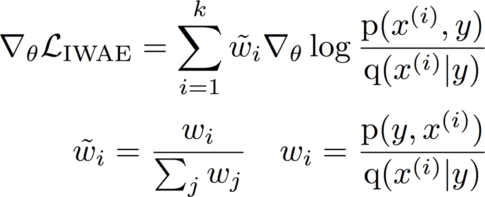

Exercise 04 - Importance Weighted Autoencoder
==================================

The importance weighted autoencoder (IWAE) is a nice conceptual extension to the basic VAE framework that is surprisingly easy to implement. Conceptually, the difference is that the IWAE loss function uses the recognition model to _propose_ samples for the approximate posterior, but then weights them according to the _true_ posterior using the importance-sampling algorithm. In terms of loss function gradients, the IWAE loss is

while the VAE loss is

.

Note that both are interpreted as maximizing a lower bound on the log likelihood of the data (the ELBO). The IWAE objective is a _tighter bound_, which means it should yield better fits to the data.

What makes the IWAE extension to VAEs especially nice is that the implementation is easy; comparing the above two gradient equations, we see that the VAE is essentially a weighted sum of gradients with equal `1/k` weights, while the IWAE uses weights that depend on the samples themselves. In fact, it will be convenient to instead interpret the VAE as a special case of the IWAE with equal weights.

Create an IWAE class
--------------------

In `vae.py`, copy your previous solution and rename the `VAE` class to `IWAE`. 

Implement a function `IWAE._get_weights()` that returns a `(batch x samples)` array of normalized weights (`K.logsumexp()` will be useful, for numerical stability purposes when summing log-probabilities). Use this to return a weighted ELBO loss.

Note that we are ultimately trying to compute a weighted _gradient_, which is not the same as a weighted _loss function_, since with the latter Keras will try to compute the gradient of the weights themselves. To fix this, wrap the weights in a call to `K.stop_gradients()`.

Recreate the VAE class as a subclass of IWAE
--------------------------------------------

Implement the `VAE` model class as a subclass of `IWAE`. You should only have to override one function: `VAE._get_weights()`. `K.ones_like()` will be useful.

Suggested IWAE-related reading
------------------------------

Burda, Y., Grosse, R., & Salakhutdinov, R. (2016). Importance Weighted Autoencoders. ICLR, 1–12. Retrieved from http://arxiv.org/abs/1509.00519

Cremer, C., Morris, Q., & Duvenaud, D. (2017). Reinterpreting importance-weighed autoencoders. arXiv.

Train a model
-------------

To train the models, `cd` into `04 - IWAE` and run `python run.py`. This will create both a VAE model and a IWAE model.

Bonus exercise(s)
-----------------

Experiment with how the latent spaces compare. Try reducing the number of layers/units in the recognition model or increasing them in the generative model. 
